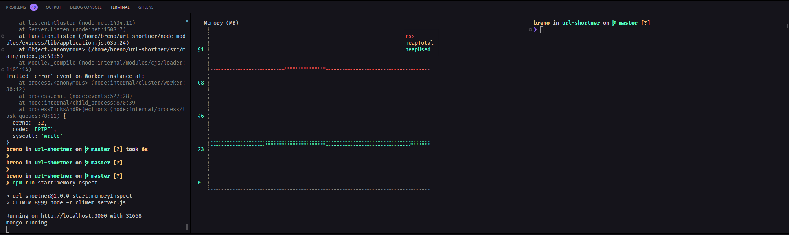
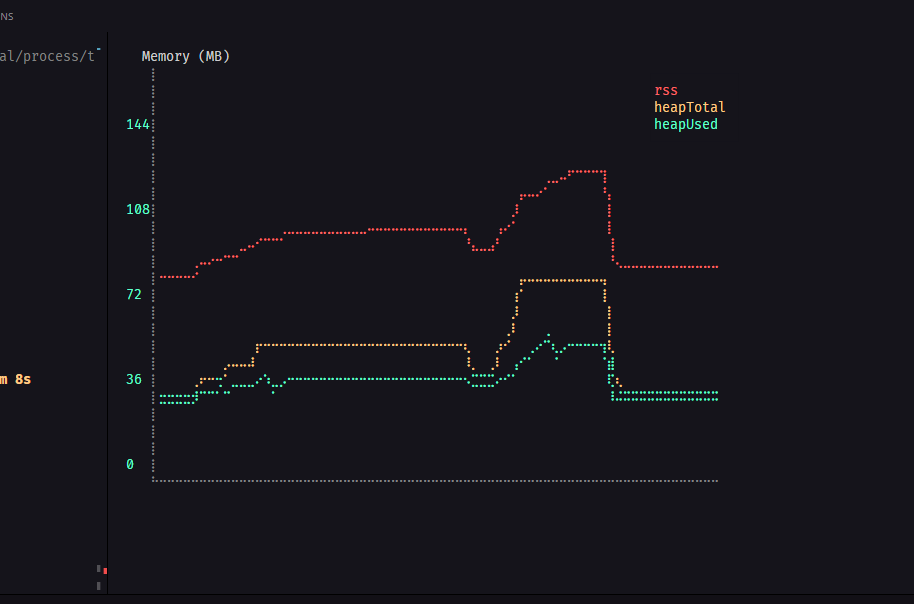
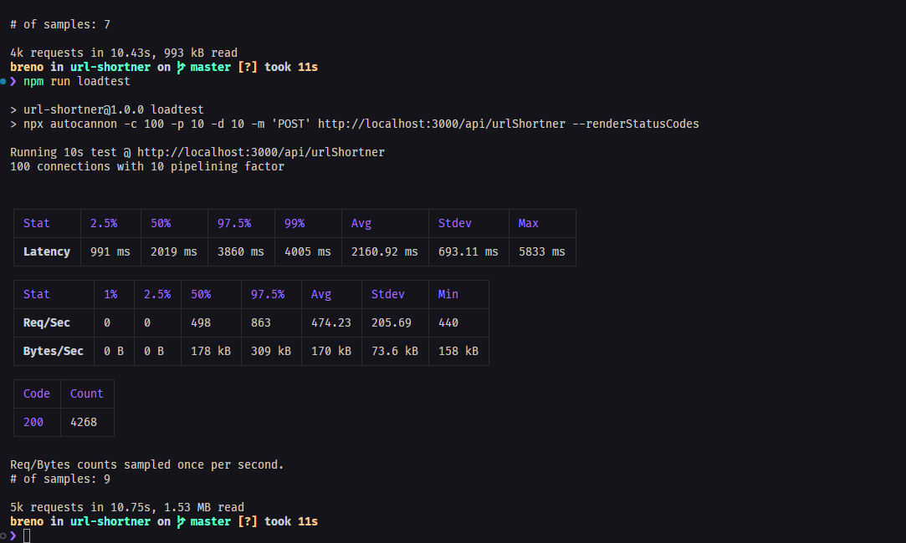

# urlShortner
### Hi there 👋
### The scope of the project is:
#### Build app server that generates a short URL when the long URL is given and provides a long URL based on the given short URL
### Stacks and API'S

#### Using <a href="https://www.mongodb.com/"> MongoDB </a> we can work with <a href="https://medium.com/permalink-univesp/nosql-o-que-s%C3%A3o-onde-habitam-do-que-se-alimentam-2ccd4cc39571"> NoSQL</a> database.

#### Using <a href="https://expressjs.com/pt-br/"> EspressJS framework </a> we can create routes abstractions, middlewares and many other functions to facilitate the creation of both API's and SPA's.

### To start the project:

1. Clone the repository

   - HTTPS:  `git clone git@github.com:brenomesquita/url-shortner.git`.
   - SSH: `git clone git@github.com:brenomesquita/url-shortner.git`
   - Enter the repository folder you just cloned:
     - `cd url-shortner`

3. Install the dependecies

   - Using: `npm install`

5. Start the application

   - Using: `npm start` you will initialize the application
   - Using: `npm run start:dev` you will initialize the application with nodemon.
   - Using: `npm run loadtest` you will make an stress test with the application.

### Application routes:
#### POST: create a short url with The long url inserted.
#####      curl --location --request POST 'localhost:3000/api/urlShortner' \
#####      --header 'Content-Type: application/x-www-form-urlencoded' \
#####      --data-urlencode 'longUrl=<URL-TO-SHORT>'` *Duplicate values ​​are not allowed.*
#### GET: 'get the long url with the short url created.
#####      curl --location --request POST 'localhost:3000/api/urlShortner' \
#####      --header 'Content-Type: application/x-www-form-urlencoded' \
#####      --data-urlencode 'shortUrl=<SHORTED-URL-CREATED>'`

### Application memory:
#### Inside 'src/benchmark', there is two files : memory and memory-usage
#### those images provides the usage of the memory of the application, and monitors if the application has any memory leak
#### for make it possible i am using the <a href="https://www.npmjs.com/package/climem"> climem </a> library

## Due to the library feedback we can see that we have no memory leak in the application

### Application performance:
#### Inside 'src/benchmark', there is one file : performance
#### that maps the application load test with 100 concurrency 10 pipeline in 10 seconds
#### for make it possible i am using the <a href="https://www.npmjs.com/package/autocannon"> autocannon </a> library

## Enjoy!! 😊😊
#### My <a href="https://www.linkedin.com/in/brenomesquita/"> LinkedIn </a>.